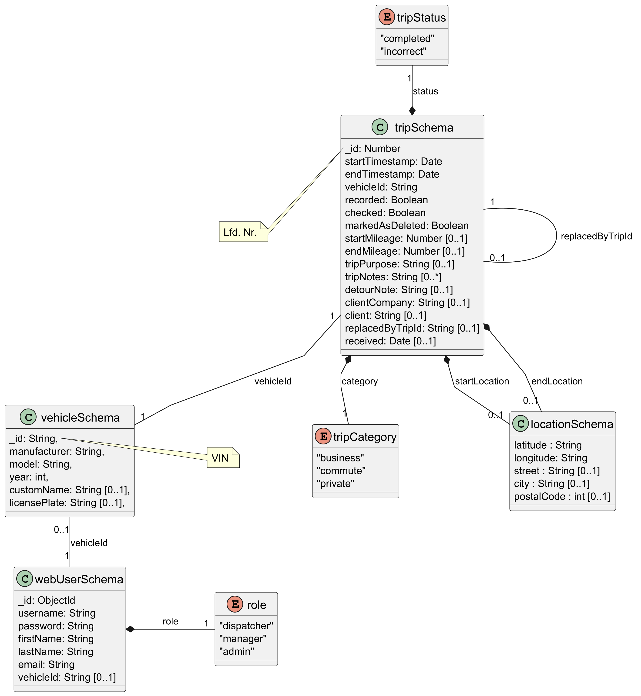

Fahrtenbuch Webanwendung (Web-Portal)
====================================

Web-Portal zur Auswertung und Pflege der im mobilen Fahrtenbuch erfassten Fahrten. Die mobile App ist hier zu finden: https://github.com/tayz98/driver_logbook

Die Anwendung ist bewusst schlank gehalten: Backend mit Node.js/Express und MongoDB, Frontend mit Vanilla JS (plus kleinen Hilfsbibliotheken wie MobX), HTML und CSS. Der Fokus liegt auf Funktionalität und Bedienbarkeit – nicht auf Clean Code.

Funktionen
----------
- Fahrten sichten, prüfen und ergänzen (Zweck, Kunde, Notizen)
- Rollen und Sichtbarkeiten:
	- Admin: alle Daten
	- Dispatcher: geschäftliche Fahrten, freie Fahrzeuge
	- Manager: nur dem Benutzer zugewiesenes Fahrzeug
- Fahrzeuge anlegen, bearbeiten, löschen
- Fahrten markieren (z. B. „löschen“) oder mehrere Fahrten zusammenführen
- Berichte für einen Zeitraum erzeugen
- Live-Updates via WebSocket
- Integrierte API-Dokumentation via Swagger unter /api-docs

Datenschutz und Zweckbindung
----------------------------
- Fahrten werden Fahrzeugen zugeordnet, nicht einzelnen Fahrern.
- Für eine ordnungsgemäße Führung des Fahrtenbuchs (in Deutschland) müssen Zweck und ggf. Kunde je Fahrt vorliegen. Die mobile App erfasst Kennzeichen/VIN, Adressen und Kilometerstände; fehlende Angaben werden im Web-Portal nachgetragen.

Technik-Stack
-------------
- Backend: Node.js, Express, Mongoose, express-session (Session-Store in MongoDB)
- Realtime: Socket.IO
- Frontend: Vanilla JS, HTML, CSS, Bootstrap, MobX
- Dev-Komfort: LiveReload

Voraussetzungen
---------------
- Node.js (empfohlen: aktuelle LTS)
- Eine erreichbare MongoDB-Instanz

Installation & Start
--------------------
1) Abhängigkeiten installieren

```zsh
npm install
```

2) Umgebungsvariablen in einer Datei `.env` im Projektwurzelverzeichnis setzen:

```
DATABASE_URL=mongodb://localhost:27017/driver_logbook
ACCESS_TOKEN_SECRET=change-me
ADMIN_API_KEY=change-me-admin
DRIVER_API_KEY=change-me-driver
# Optional
# PORT=3000
```

3) Entwicklung starten (empfohlen mit eigener Port-Variable, um root-Rechte zu vermeiden):

```zsh
PORT=3000 npm run dev
```

Alternativ (Standardport 80 – unter Linux meist nur mit sudo):

```zsh
npm start
# oder
npm run linuxStart
```

Aufruf im Browser
-----------------
- Startseite / Login bzw. Dashboard: http://localhost:PORT/
- Fahrzeuge: http://localhost:PORT/vehicles
- Bericht: http://localhost:PORT/report
- Flutter-Logs (öffentlich): http://localhost:PORT/flutter_logs
- API-Dokumentation (Swagger): http://localhost:PORT/api-docs

Authentifizierung & API-Nutzung
-------------------------------
- Das Web-Portal nutzt Server-Sessions (Cookie) für angemeldete Nutzer.
- Für API-Zugriffe ohne Session werden API-Keys im Header `x-api-key` verwendet:
	- Admin: `ADMIN_API_KEY`
	- Driver: `DRIVER_API_KEY`
- Wichtige Endpunkte (Details in Swagger):
	- `POST /api/login` (Session-Login)
	- `GET /api/trips`, `GET /api/trip/:id`, `POST /api/trip`, `PATCH /api/trip/:id`, `DELETE /api/trip/:id`
	- `GET /api/vehicles`, `POST /api/vehicle`, `PATCH /api/vehicle/:id`, `DELETE /api/vehicle/:id`
	- `GET /api/report?fromDate=YYYY-MM-DD&toDate=YYYY-MM-DD`

Hinweise
--------
- LiveReload ist aktiviert; im Code ist eine externe Domain/Port hinterlegt. Für lokale Entwicklung genügt das Starten über `npm run dev` (die Seiten werden dennoch neu geladen).
- CORS ist für `localhost` und die konfigurierte externe Domain freigegeben.

Diagramme 
------

### Komponentendiagramm
.png)

### Klassendiagramm



Verwandte Projekte
------------------
- Mobile App (Erfassung): https://github.com/tayz98/driver_logbook


